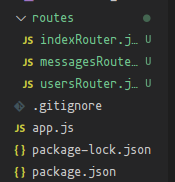

# Express Server setup basics

Starting in a new folder, initiate the node enviroment and generate a package.json using

# Part 1. The app

## Environment setup

```Bash
npm init -y
```

node package manager will now initiate a new enviroment, and use yes for all questions using the yes flag =y.

Now, install express

```Bash
npm install Express
```

The latest express package will be downloaded, and put into the node_modules folder, it's reference will be added to the package.json.

Now to create a basic express server. Start by creating a new file, app.js in the root directory.

```Bash
touch app.js
```

### Optional, initiate GIT

If you want to push this project to the repository eventually, setting up git in the enviroment is needed.

Initiate git in the working directory using

```bash
git init -b main
```

This will establish a git envriroment and set the working branch to main.

Before anything else, make sure to also create the .gitignore file.

```bash
touch .gitignore
```

In this file, add node_modules/ on the first line.
Anything else we would not want to publish to the entirety of the internet,
like secrets, credentials, etc. Should all be added here for reference.

Start by commiting the .gitignore file

```bash
git add .gitignore
git commit -m 'initial commit'
```

Use the same approach to add our other files, package-lock and package.json to the git staging.
As the project proceeds, remember to commit early and often, and use `git status` as needed to find any changes, as well as `git diff 'file path'` to review the changes if needed.

## The app.js file

App.js will server as the starting point for the Express server.
The file can be named anyhting we want, such as index.js, or main.js.
For the purposes of this project, we will simply go with app.js,
as stated in the Express docs

```javascript
const express = require('express');

const app = express();

app.get('/', (req, res) => res.send('Hello, world!'));

const PORT = 3000;
app.listen(PORT, () =>
    console.log(`My first express app - listening on port ${PORT}!`)
);
```

### **See app.js for a breakdown of each line.**

## The request's journey

With the server up and running on port 3000, we will be able to send a request to the route specified!

Navigating to https://localhost:3000/ while the Express server is running on the local computer, will result in the browser sending a GET request to the / path of the server we have established on port 3000 of the localhost domain.

The browser will then receive a response from the server, and display whatever it receives in the browser window!

Congratulations, you have in essence just unveiled how every connection with any website boils down to.

User sends a request to a domain and port

Server receives request, and processes it in a request object.

The request object is passed through a series of functions called middleware functions.

Server eventually sends a response to user via the same connection, based on the results of the request objects journey.

User browser unpacks response and displays its contents.


Our app for instance, accepts a request as a GET request to the / path. Which matches the route specified in the app.js file

```javascript
app.get('/', (req, res) => res.send('Hello, world!'));
```

The request is passed through the chain of middleware functions, in our case, we have a single one:

```javascript
(req, res) => res.send('Hello, world!');
```

Express passes the conventionally named req(uest) object, passed as the first parameter, and the res(ponse) object as the second parameter, into the callback function.

The callback tells the response object, to respond to the request by .send(ing) the string "Hello world!"

Since there is no more code to run, the function returns. And since Express has been told to respond to the request, it ends the request.response cycle.

The browser now receives the server's response, and displays it on screen. "Hello, world!" should now appear.

This could have been anything we would have wanted to defined, a math equation, a story, even a file.

## Developing the app

During development, various changes will be made. In order for most changes to manifest, we must restart the app.

To prevent a obnoxious amount of manual restarts, we can create a new node command in the package.json file, that will tell express to hot load changes using its built in --watch flag.

So go to package.json and add

```json
    "watch": "node --watch app.js"
```

in the scripts section of the file.

Running this script, will tell node to watch for changes, as well as any changes to files it depends on, and automatically restart the server.

Alternatively, nodemon, a highly customizable package can be added to the project and configured.
But this is a more advanced approach.

# Part 2. Routes

Setting up our first app.get was a great start. In any real app however, we would want to be able to handle many different types of requests, for various different tasks.

Enter, the routes.

Routes are a way to match a requests HTTP verb, like GET or POST, as well as the URL path, against the apps set of middleware functions - the controllers.

To use routes, we use expresses verb methods; `.get` and `.post`, and tie the request and response objects to the appropriate actions.

For example, lets take our previous route:

```javascript
app.get('/', (req, res) => res.send('Hello, world!'));
```

`app.get("/"...` tells the app that if it receives a GET request from a user to the / path, it should pass the request through the following set of functions.

Similarily, lets make a new path:

```javascript
app.post('/messages', (req, res) =>
    res.send('This is were you can eventually see any messages')
);
```

now, sending any post request to the localhost:3000/messages path, will tell Express to pass it through `app.post("/messages"...`s following set of functions, in this case, `res.send` again.

**If at any point you would want a route that matches against any HTTP verb, you can use app.all() to match against all verbs**

**Beside GET and POST verbs, there are various other HTTP verbs, like PUT and DELETE, commonly used in REST APIs, this will be covered later**

# Part 2.2 - Paths

The first argument passed through any route is the path to match.
A path can be either a string, or a regular expression.

Paths are a powerful way to identify needs of a request, depending on the way the path is defined.

`/messages` matches against messages exactly.
`/messages/all` matches only if the path is specifically '/messages/all'
not '/messages' nor '/messages/new'

Besides this, with string paths, we can also use certain symbols like ?, +, \*, or () to facilitate some pattern-matching functionalities, similar to regular expressions.

`/messages?` makes the character optional, in this case the last 's'
this path matches both /message and /messages

`/(messages)?` '()' groups characters together, allowing symbols to act on the group.
This path matches both / and /messages

`/foo*/bar*bar` \* is a wildcard, matching any number of characters.
This path matches /foo/barbar and even /foo-FOO/bar3dasdhioujah

**Remember - Order matters, The routes will be set up in the server by the order they are defined.**

For example, if we were to try to reach /messages here:

```js
// Does our request path match here? It DOES, since wildcard accepts any path!
app.get('*', (req, res) => {
    res.send(
        '* is a great way to catch all otherwise unmatched paths, e.g. for custom 404 error handling.'
    );
});

// This path is never reached, as the request was handled by the above path!
app.get('/messages', (req, res) => {
    res.send(
        "This route will not be reached because the previous route's path matches first."
    );
});
```

we would instead reach \* first, as our request path would also match a wildcard.
Therefore, make sure to keep the order of paths in mind, and define depending on specificity of the paths.

```javascript
// localhost:3000/messages will reach this path, as it matches the path defined.
app.get('/messages', (req, res) => {
    res.send(
        "This route will not be reached because the previous route's path matches first."
    );
});

// localhost:3000/gnmdsaoigmnadko or anyhting NOT localhost:3000/messages will reach this wildcard now.
app.get('*', (req, res) => {
    res.send(
        '* is a great way to catch all otherwise unmatched paths, e.g. for custom 404 error handling.'
    );
});
```

# Part 2.3 - Route parameters

Route parameters allows us to contain and use parameters passed through the URL paths in our request handling middleware.

For instance, in order to get all messages specifically posted by Monkey, we can denote a route parameter by starting the segment of the url with a : followed by whatever we want to name the parameter.

E.g

```javascript
app.get('/:username/messages', (req, res) => {
    // log the request parameter to console
    console.log(`Hello ${req.params}!`);
    // end the response.
    res.end();
});
```

You can also get specific parameters from the req.params object

```javascript
app.get('/:username/messages/:messageId', (req, res) => {
    // Get specific parameters from the params object.
    console.log(
        `Hello ${req.params.username}, you wrote ${req.params.messageId}!`
    );
    // End response.
    res.end();
});
```

By providing both a :username and :messageId on our path, we will be able to extract very specific data

Take a moment to just imagine the potential uses of extracting and using these parameters from a request, cool right?

# Part 2.4 - Query parameters

"How do you ask the server a question?" would probably be a pretty easy question to come by if you came by a task like establishing any kind of search function, or maybe creating an API endpoint that accepts optional search parameters. For example: "Return weather data from a specific city" could be handled using a query parameter.

Query parameters appear at the end of a URL, a `?` denotes the start of a query parameter, each consisting of a key-value pair `key=value` and seperated by anmpersand `&`. These symbols are special, as they are more like arguments passed to a given path, than part of the path itself.

For example
`/monkey/messages?sort=date&direction=ascending` will match still match the route with the `/:username/messages` path, but thanks to the query parameters `sort=date` and `direction=ascending` we can access more specific data to return inside the middleware chain.

Express handles parsing any query parameters in a request, and will populate a special `req.query `object with all the key-value pairs it finds. Any repeated keys will be stored in an array.

Accessing these query parameters is done much in a similar way as with the `req.params` object.

So, editing our `/:username/messages` path to also handle any query parameters as follows:

```javascript
// Route parameter path:
app.get('/:username/messages', (req, res) => {
    console.log(`Hello ${req.params.username}!`);
    console.log(`All queries:`, req.query);
    if (req.query.sort) {
        console.log(`Specific query 'sort':`, req.query.sort);
    }
    res.end();
});
```

Will allow us to query on top of the path!

So sending this: `http://localhost:3000/monkey/messages?sort=likes&direction=ascending`
results in this response:

```
Hello monkey!
All queries: { sort: 'likes', direction: 'ascending' }
Specific query 'sort': likes
```

Amazing!

# Part 3 Routers

As a project increases in size and scope, alot of different paths and routes will start cropping up to handle various different tasks, in these cases, organising our routes into groups for each specific task will help alleviate bloat, and promote readability. Doing this from start will make projects more easily scalable as well.

Seperating various routes into their own router files will solve this.

Starting by creating a new folder to hold these files, routes/ inside, we will then create a file for each type of page or data that we would want to be able to access.

In our case, lets create a router file for users, messages, and the index.



Now, lets migrate our various paths to the respective routers. Take messagesRouter.jsx for instance:

```javascript
const { Router } = require('express');

const usersRouter = Router();

usersRouter.get('/', (req, res) => res.send(`All users`));

usersRouter.get('/:username', (req, res) => {
    const { userId } = req.params;
    res.send(`User ID: ${userId}`);
});

module.exports = usersRouter;
```

-- see `routes/usersRouter.jsx` for full breakdown.

To use these files in our app, we just import them like any other module, then link them to a specific path using `app.use`

```javascript
// import routers
const messagesRouter = require('./routes/messagesRouter');
const usersRouter = require('./routes/usersRouter');
const indexRouter = require('./routes/indexRouter');

// assign paths to routers
app.use('/messages', messagesRouter);
app.use('/users', usersRouter);
app.use('/', indexRouter);
```

Now we can avoid bloating app.js with a million different routes! SO much more readable!

in app.js, we have now specified that any path starting with `/messages` will be passed through the messagesRouter for matching.
Likewise for `/users`
Any other routes will pass through the index router `/`

**Remember: Organize by specificity**

    Note:

    Routers extend the assigned parent path.
    So all routes in our routers implicitly start with their specified parent path.

    E.g `messages/:messageId` to get a specific message id

# Part 4 - controllers

Controllers act as the ultimate middleman, it handles passing requests to the correct model functions, but focuses on delegating specific requests to their respective tasks, rather than doing them itself.

As the name suggests, the controller acts as the brain of its given area of responsibility, making sure that each component performs its tasks in delivering a response to a given request.

In short, it makes sure a request to its given path is passed along to the correct middleware, and responded to.

There are various methods at our disposal to do this, we have already used one of them!

-   `res.send` is a general-purpose method for sending a response, compared to other more specific response methods it is more flexible, in that it can automatically set the content-type header based on the data passed to it. E.g Pass a object, and it will be stringified as a JSON and the content-type header will be set to application/json

-   `res.json` is a specific handler for requests that are expected to involve JSON. Content-types will always be set to applicaiton/json and data sent as JSON

-   `res.redirect` as the name suggests, redirects the client to a different URL.

-   `res.render` uses a template engine to render a view template, and send the rendered HTML as a response.

-   `res.status` is a useful method that can be used to manually set the HTTP Status code of a response. **This does not end the request-response cycle by itself however**, and should be chained to any of the other response methods.

### Keep in mind that a response method does not end a function execution, and should usually be used at the end of a given function.

For example:

```javascript
app.use((req.res) =>{
    // resolve with response and end request-response cycle
    res.send("End response")

    // Function still runs as there is more to do however
    console.log("Still running")

    // An error will be thrown as you cannot send more than one response in a function!
    res.send("Error will be thrown")
})
```

# Part 4.2 - Middleware

As teased earlier, middleware functions form the core concept of express, and is the power house behind its use-cases for handling requests and responses.

Any function that is run from the moment a request is passed through a route path, and a response is returned, is a middleware function.

Middleware functions typically take three arguments

-   `req` Is the request object, holding the incoming HTTP request

-   `res` is a response object, holding the HTTP response that will be returned to the client

-   `next` is a special function that pass control of the request to the next middleware function in the chain. This function is optional.

**The names are just convention, and can be named anything you want.**

The purposes and use cases of a middleware function can be vast. Some of which can include

-   Modifying a request or response object

-   Executing additional code, like validation, or authentication etc.

-   Ending the request-response cycle. Like with res.send. This can be done anywhere in the middleware chain, and will prevent the request from being passed further down the line. This can be useful for instance, if a error occurs and the cycle should just return the error.

This and alot more is possible with middleware functions!

    Express is a rich ecosystem of various packages created by other talented programmers, if you run into a issue or use-case there may very well already be a package for you to use for middleware. Like handling authentication, cors, rate limiting, session handlers, logging, etc.

    **Keep in mind that not every little task may need a new package, importing alot of packages takes performance as well, and keep a healthy critical mind as to which packages you trust ot handle your requests and responses.**

# Part 4.3 - Middleware levels

Middleware is typically divided into application level middleware, and router level middleware depending on their roles in the application.

## 4.3.1 - Application level middleware

Application level middleware are bound to a instance of express using `app.use` or other express methods like `app.get` and `app.post`

These functions are executing in every incoming request matching the specified path.

If no path is specified, it is defaulted to `/` matching any incoming request.

These middleware functions are typically placed on the top level of the application code to ensure they always run first.

Common built-in middleware functions included with Express that are used for this include:

-   Body parsers(`express.json`, `express.urlended`) allowing correct parsing of incoming request bodies. So that they can be used through `req.body`

-   Serving static files like `app.use(express.static('public'))` which will serve static files such as HTML, CSS and javascript as well as images and more.

-   Setting up views for view engines

## 4.3.2 - Router level middleware

Router level middleware works similarily to applicaiton level middleware, but is bound to an instance of an Express ROUTER rather than the app itself, using methods like `router.use` and `router.get` functions.

These middleware functions trigger only when the requestm atches the specific route.

# Part 4.4 - Making middleware

Making middleware is done like any other function, the only difference being specifically handling the req, res, and next objects/methods inside.

An example basic middleware function chains could be:

```javascript
function myFirstMiddleware(req, res, next) {
    // Lets just log something to console
    console.log('My first middleware executed!');

    // modify the request object here
    req.customProperty = 'Some new property';

    // and pass control to the next middleware
    next();
}

// register the middleware functions through app.use making it application-level middleware.
app.use(myFirstMiddleware);
```

    NOTE: Keep in mind that middleware functions are executed in the order they are defined, and registered in the application.

    Therefore any middleware that make changes to the request object should usually be placed at the very top of the application in order for us to see their changes in all middleware functions below it.

# Part 4.5 - The journey of a request... extended.

Controllers are just midddleware functions in the end, and are used by the route handlers.

The controller comes in to play whenever a request is received and a route is matched with the request objects HTTP verb and path.

The route determines the controller that should handle the request, based on the middleware chain.

The controller then takes over and performs its assigned actions by delegating the request to its appropriate middleware, in order to fulfill the request.

Once done, the controller passes the processed data to the view, rendering the data in a suitable format to return to the client. Like HTML, or JSON.

    Typical naming convention are usually based on the route they are attatched to.
    A GET route should trigger a getSomething middleware,
    A POST route should trigger a createSomething middleware,
    ETC. This convention is typically based on the person however.

# Part 4.6 - Creating a controller!

Finally, lets actually MAKE a controller

## Part 4.6.1 - Organising the controllers

Like with our routers, we will organize our controllers neatly inside their own `/controllers` folder

Inside the folder, have a controller file for each respective router, e.g

`usersRouter -> usersController`

`messagesRouter -> messagesController`

`indexRouter -> indexController`

This approach will encourage separation of concerns and provide convenient access to relevant controller functions.

Common naming convention suggest naming respective modules after their respective parent modules.
This will make it easier to identify relations between files, and later for debugging.

## Part 4.6.2 - Controller functions

Making functions for our controllers is straight forward like any other function, just ensure that any function that includes any kind of interaction with a database is created in a proper asynchrous fashion using async/await.

As an example, in usersController we have made a controller function for fetching a user ID

```javascript
// users controller

const getUserById = async (req, res) => {
    const userId = req.params.id;
    const user = await exampleDBQueryToGetUser(userId);

    if (!user) {
        res.status(404).send('User not found');
        return;
    }

    res.status(200).send(`User found: ${user.name}`);
};
```

    See ./controllers/userController.js for line breakdown

Here, we made a controller function that fetches a user object from our fictional database, based on the provided userId in the request parameters.

As with the files, common naming conventions for the controller functions are usually based on the route they are attached to, the REST method they utilise, and a optional descriptor if needed,
like parameters used in the function(like id),
sorting methods(ascending),
specific object parts (like details, or titles) etc..

Like for our `getUserById` functions other examples would be
GET -> `get(route)(description)` -> `getUserDetails`
POST -> `create(route)(description)` -> `postMessage`
DELETE -> `delete(route)(description)` -> `deletePostByDate`

## Part 4.6.3 - Error handling, try/catch

Building robust applications requires graceful error handling throughout the applicaiton.

Implementing proper error handling early will provide meaningful error responses to the client and prevent the application from crashing unexpectedly, which is the last thing we would want to happen.

The approach to handling errors exists in numerous ways, one of which is using javascripts built in try/catch statements.

Lets implement some error handling in our `getUserById` controller function

```javascript
const getUserById = async (req, res) => {
    const userId = req.params.id;

    // Start try/catch block
    try {
        const user = await exampleDBQueryToGetUser(userId);
        if (!user) {
            res.status(404).send('User not found');
            return;
        }

        res.status(200).send(`User found: ${user.name}`);
        // Catch errors from try block (if any) and assign to error object.
    } catch (error) {
        // Print to console for developer
        console.error('Error retrieving user:', error);
        // Gracefully respond with error to end-user.
        res.status(500).send('Internal Server Error');
    }
};
```

This will gracefully handle the error without crashing the entire program.

    Alternatively, call the next(error) function and pass the response error to the next middleware.
    This could be a error handling middleware at the end of the chain.
    If no middleware is provided, express will render a error page in HTML using express default view.
    Which is not very pretty for the user.

This is a fully functional way to handle errors in our functions.

However, eventually we will run into an issue, as we would have to add the same try/catch block to ALL controllers.

## Part 4.6.4 - Error handling, express-async-handler

# Do you want to know more?

If interested, have a look at [the express docs](https://expressjs.com/en/4x/api.html)

or more specifically the [routing section](https://expressjs.com/en/guide/routing.html)

If interested, have a look at [the odin project](https://www.theodinproject.com/lessons/nodejs-routes) that covers this in great detail!

```

```

```

```
